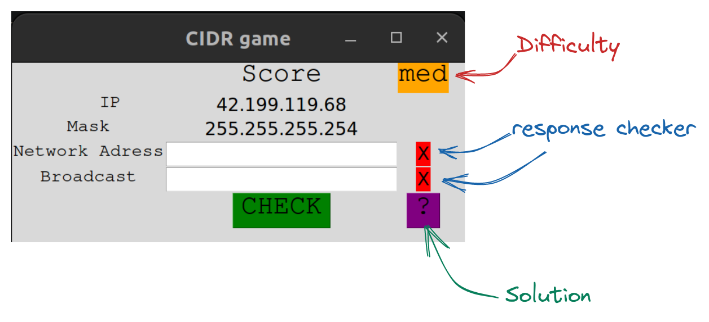

# CIDR teaching game
A small game with different difficulties to teach you how CIDR ( classless inter domain routing) works.
Provided with a mask and a random ip adress, you need to find the network and the broadcast address.
The difficulty depends on the given mask

